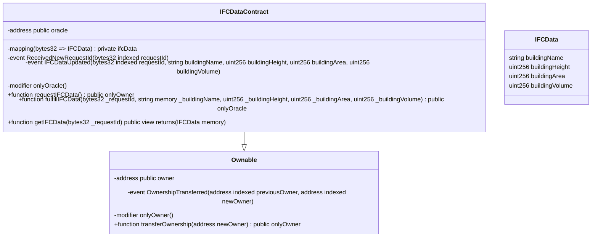

# solidity-ifc-data

 

---

  
  
  
  
  

## Introduction

The `IFCDataContract` is a Solidity smart contract designed to integrate with Industry Foundation Classes (IFC) data via an Oracle. 

> IFC is a data standard used widely in the architecture, engineering, and construction (AEC) industry to facilitate interoperability between different software used in these fields. The data standard encompasses various elements of building information modeling (BIM) including building elements, cost management, project management, structural elements, and more.

The `IFCDataContract` contract acts as a client contract in a decentralized oracle network and is designed to request specific IFC data from an external data source, receive and store that data, and then provide access to the stored data.

The contract includes:

- A function (`requestIFCData`) to request IFC data from the oracle. This function emits a `ReceivedNewRequestId` event that includes the unique request ID for tracking the request.
- A function (`fulfillIFCData`) that is used by the oracle to fulfill the data request. This function updates the contract's state with the received data and emits an `IFCDataUpdated` event.
- A function (`getIFCData`) to access the stored IFC data using the request ID.

The contract is derived from the `Ownable` contract, giving it a basic access control mechanism with an owner role. The owner can request IFC data, while the oracle is the only address authorized to fulfill data requests.

This contract represents a simple yet powerful example of how blockchain technology can interact with industry-specific standards like IFC, enabling the creation of decentralized applications that can serve specialized use cases in sectors such as construction and architecture.

Please note, this contract serves as a conceptual demonstration and needs thorough testing, auditing, and potential modifications before any production use. Always exercise caution and due diligence when working with smart contracts.

## Class Diagram

In this diagram:

- `IFCDataContract` is the main contract.
- It is a subclass of `Ownable`, meaning it inherits from the `Ownable` contract.
- `IFCData` is a struct used in the `IFCDataContract` contract.
- The contract has a mapping called `ifcData` from `bytes32` to `IFCData`.
- Functions, modifiers, and events in the contract are also represented.
